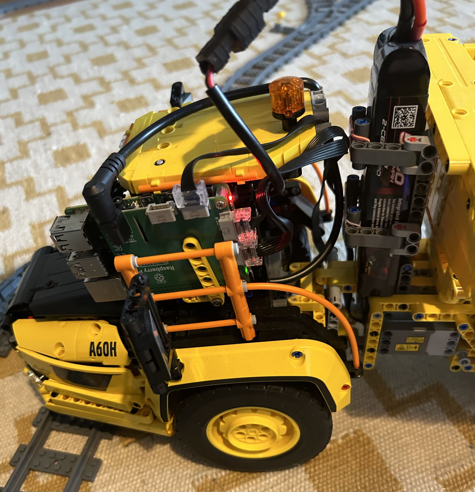
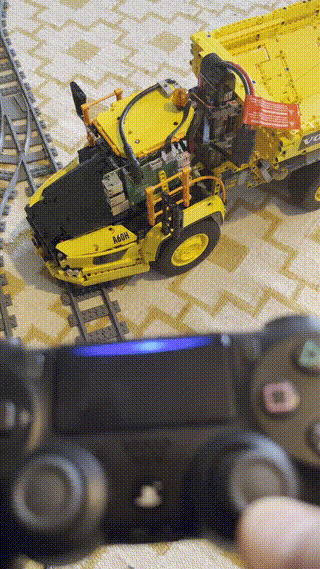

# LEGO-42114

## About the Project
It all started when my son wanted to drive the dumper, but it was difficult for him to use the smartphone as the controller. The touch screen wasn't very forgiving if you didn't press exactly in the right area. This was the main reason for the decition to start the project with replacing the controller with a PS4 controller. There were two parts which made up the greater part of the work, and that was to (1) recreating already existing properties of the dumper in a python script and (2) control the LEGO motors from an embeeded hardware with access to bluetooth.

## Getting Started

### Prerequisites

You need to complete the lego model 42114 with the following items:

(1) Raspberry Pi model 4 <br>
(2) Raspberry Pi Build HAT <br>
(3) PS4 Controller <br>
(4) Traxxas 2S 5000 mAh LiPo Battery with iD (Part# 2842X) <br>
(5) Traxxas EZ-Peak Charger with iD (Part# 2970X) <br>
(6) Traxxas connector iD Male (Part# 3070X) <br>
(7) Power cable, 18 AWG, DC 5.5 x 2.1 mm, 90 degree right angled, YACSEJAO

### Modifications to the Model



### Installation

To get started with the RPI4 and Pi Build HAT follow the instructions [here](https://www.raspberrypi.com/products/build-hat/). You may first need to install pip, `sudo apt-get install pip`.

#### PS4 Controller

First run

```angular2html
sudo apt update
sudo apt full-upgrade -y
sudo apt install libbluetooth-dev checkinstall pkg-config
```

The `controller.py` code depends on the pyPS4Controller package, which you need to install via

``
pip3 install pyPS4Controller
``

Can't quite remember how I got the PS4 controller to automatically connect to the RPI4. There are a number of instructions on the internet that describe this, which you can use. The commands I used are listed below.
```angular2html
sudo systemctl status bluetooth
hcitool dev
hcitool -i hci0 scan
bluetoothctl
```

#### Controller Code

Clone the small repository where the main code (`controller.py`) is located.

```
git clone https://github.com/emibr948/LEGO-42114.git /home/$USER/LEGO-42114
```

In the end of `/home/$USER/.profile` put

```
echo Running Lego Controller
python /home/$USER/dumper/controller.py &
python /home/$USER/dumper/controller.py &
```

## Final Result


 


why two times?

## License
Under the MIT License. See LICENSE.txt for more information.

Basically, if you think the status of the project can be improved or if you want to use the project for other purposes, you are welcome to do so.


## Acknowledgments
LEGO System A/S, DK-7190 Billund, Denmark, thank you for the work in creating models that can also excite extracurricular activity in adults.